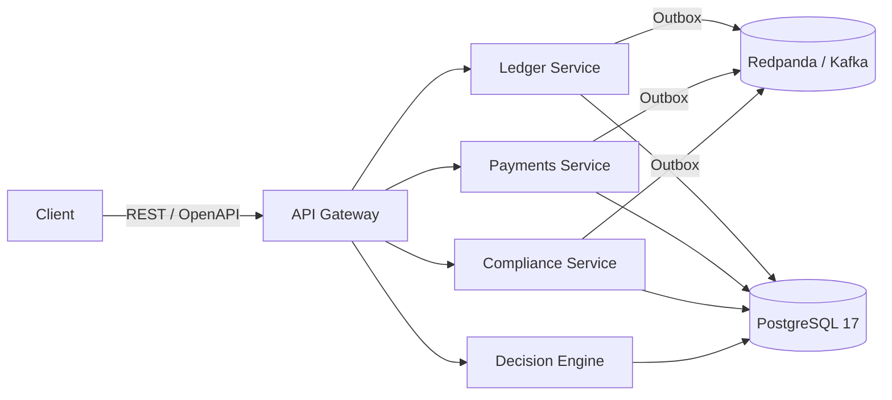

<!-- SPDX-License-Identifier: BUSL-1.1 -->

# FinCore Engine

> An open-source financial core for the JVM - double-entry ledger, payment orchestration, compliance workflows, and a deterministic decision engine.

[](LICENSE)
[](https://github.com/tiana-code/fincore-engine/actions)
[](https://adoptium.net/)
[](https://kotlinlang.org/)

---

## What it is

FinCore Engine is a modular, JVM-based financial core that provides the infrastructure layer for regulated fintech products. It handles the hard parts - ledger consistency, idempotent payment processing, KYC/AML orchestration, and explainable compliance decisions - so teams can focus on their domain logic.

**What it is not:** a payment gateway, a banking-as-a-service product, or a SaaS platform. It is a self-hosted, embeddable engine for teams building their own regulated financial products.

Full context: [Vision](https://github.com/tiana-code/fincore-engine/wiki/Vision) · [Architecture Overview](https://github.com/tiana-code/fincore-engine/wiki/Architecture-Overview) · [Use Cases](https://github.com/tiana-code/fincore-engine/wiki/Use-Cases)

---

## Features

- **Double-entry ledger** with invariant enforcement at application, service, and database layers - balances never drift.
- **Idempotent payment orchestration** - safe to retry; deduplication via `Idempotency-Key` header and transactional outbox.
- **KYC/AML orchestration framework** - plug-in interfaces for identity verification and compliance screening providers.
- **JSON DSL Decision Engine** - deterministic, auditable rule evaluation with full explainability; no embedded scripting languages.
- **OpenTelemetry-native observability** - distributed tracing, structured logging, and Micrometer metrics out of the box.

---

## Quick start

Requirements: Java 21+, Docker, Docker Compose.

```bash
git clone https://github.com/tiana-code/fincore-engine.git
cd fincore-engine

# Start all infrastructure (PostgreSQL, Redpanda, Keycloak, Redis)
docker compose -f deploy/docker-compose.yml up -d

# Run the ledger service
./gradlew :services:ledger:bootRun

# Seed demo accounts and run the 5-minute demo
./scripts/demo.sh
```

Full guide: [Getting Started](https://github.com/tiana-code/fincore-engine/wiki/Getting-Started)

### Observability profile (optional)

The telemetry backends are an opt-in Compose profile, so the default stack stays lean:

```bash
docker compose --profile observability up -d
```

This adds Prometheus (`:9090`, scrapes the services' `/actuator/prometheus`), Grafana (`:3000`, anonymous access
enabled, datasources pre-provisioned), Tempo (receives OTLP traces via the OpenTelemetry collector) and Loki. The
services export traces to the collector automatically when the profile is up. Loki is provisioned as a datasource;
shipping the services' JSON logs into it (a log shipper) is a follow-up - until then use `docker compose logs`.

---

## Repository layout

```
fincore-engine/
├── api/                    # OpenAPI 3.1 specifications (source of truth)
├── libs/
│   ├── fincore-core/       # Money, IDs, shared value types
│   ├── fincore-events/     # Event envelope, outbox abstractions
│   └── fincore-test-support/  # Testcontainers helpers, test data builders
├── services/
│   ├── ledger/             # Double-entry ledger service (Spring Boot)
│   ├── payments/           # Payment orchestration service
│   ├── compliance/         # KYC/AML orchestration service
│   └── decision/           # JSON DSL decision engine
├── deploy/                 # Docker Compose, Helm charts, Grafana dashboards
├── scripts/                # demo.sh, seed.sh, sync-wiki.sh
├── wiki/                   # GitHub Wiki source (gitignored; push to .wiki.git)
└── docs/                   # Plans, ADRs, private context (partially gitignored)
```

---

## Architecture



Full C4 diagram and service descriptions: [Architecture Overview](https://github.com/tiana-code/fincore-engine/wiki/Architecture-Overview)

---

## Why JVM, why now

Kotlin on the JVM offers virtual threads, sealed classes, and a mature ecosystem for building correct, maintainable financial software. The JVM has a long operational track record in regulated industries. Details in the [FinCore manifesto](https://itiana.dev/blog/fincore-manifesto).

---

## License

FinCore Engine is licensed under the **Business Source License 1.1** (BUSL-1.1).

- **Until 2030-04-28** - free for non-production use, evaluation, education, and contributions back to this project. Production use requires a commercial license from the maintainers.
- **From 2030-04-28** - automatically converts to **Apache License 2.0**, open for any use including commercial production.

See [LICENSE](LICENSE) for the full text. For the rationale behind this choice, see [ADR-0002](https://github.com/tiana-code/fincore-engine/wiki/ADR-0002-BSL-License) and [ADR-0009](https://github.com/tiana-code/fincore-engine/wiki/ADR-0009-BSL-vs-AGPL).

---

## Contributing

Contributions are welcome. Please read [CONTRIBUTING.md](CONTRIBUTING.md) before opening a pull request. For architectural questions, open a [Discussion](https://github.com/tiana-code/fincore-engine/discussions).

## Security

To report a vulnerability, follow the process in [SECURITY.md](SECURITY.md). Do not open a public issue for security problems.

## Code of Conduct

This project follows the [Contributor Covenant 2.1](CODE_OF_CONDUCT.md). By participating you agree to abide by its terms.

---

## Sponsoring

If FinCore Engine saves you engineering time, consider [sponsoring on GitHub](https://github.com/sponsors/tiana-code). Sponsors get priority support and input on the roadmap.

---

## About

Built by [Tiana Rogozina](https://itiana.dev) - JVM engineer focused on financial infrastructure. Blog · Talks · Newsletter at [itiana.dev](https://itiana.dev).
